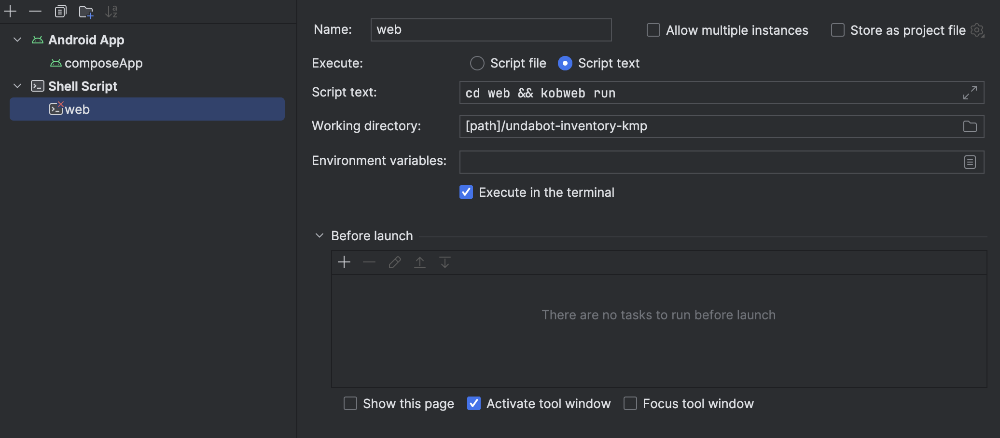

This is a Kotlin Multiplatform project targeting Android, iOS, Web.

* `/composeApp` is for code that will be shared across your Compose Multiplatform applications.
  It contains several subfolders:
  - `commonMain` is for code that’s common for all targets.
  - Other folders are for Kotlin code that will be compiled for only the platform indicated in the folder name.
    For example, if you want to use Apple’s CoreCrypto for the iOS part of your Kotlin app,
    `iosMain` would be the right folder for such calls.

* `/iosApp` contains iOS applications. Even if you’re sharing your UI with Compose Multiplatform, 
  you need this entry point for your iOS app. This is also where you should add SwiftUI code for your project.

* `/web` contains the web application built with kobweb. To run it you need to add the kobweb to your system, which 
   is easy with brew (or any other package manager), cd into the web module and run `kobweb run`, for more info
   please visit the kobweb [README](https://github.com/varabyte/kobweb). To run web app directly from Android Studio, you can create separate configuration.
   Add new configuration as shell script:
   

* `/shared` is for the code that will be shared between all targets in the project.
  The most important subfolder is `commonMain`. If preferred, you can add code to the platform-specific folders here too.


Learn more about [Kotlin Multiplatform](https://www.jetbrains.com/help/kotlin-multiplatform-dev/get-started.html),
[Compose Multiplatform](https://github.com/JetBrains/compose-multiplatform/#compose-multiplatform)…

## Web app hosting

Web app uses [Firebase Hosting](https://firebase.google.com/docs/hosting) as hosting solution. For production we use live channel and for QA we use preview channel.
Also, we set different environments for each channel (`PROD` and `DEV`) so we can use different database for each environment.
Predefined [Github Action](https://github.com/marketplace/actions/deploy-to-firebase-hosting) is used for automatic deploy.

### Production deploy instructions
To deploy production version of an app, you need to run [Web - Prod deploy](https://github.com/MarinJuricev/product-inventory-kmp/actions/workflows/firebase-hosting-prod.yml) workflow.
Also, this workflow is triggered automatically when push to main branch is made.

### QA deploy instructions
To deploy an app for QA, you need to run [Web - QA deploy](https://github.com/MarinJuricev/product-inventory-kmp/actions/workflows/firebase-hosting-dev.yml) workflow.
Notice that after this workflow is finished successfully, [version](https://github.com/MarinJuricev/product-inventory-kmp/blob/develop/release/version_web.properties) is updated (build number incremented). Also, generated app url contains version number so you can easily distinguish between different versions.
The newly generated link is available for 30 days. 

Example of generated app url: https://MarinJuricev-inventory-app--1-0-0-1-88tn872n.web.app

After deploy is finished, it should be visible in [Firebase Console](https://console.firebase.google.com/u/1/project/MarinJuricev-inventory-app/hosting/sites/MarinJuricev-inventory-app).

When running Kobweb for development purposes, we can run it using `cd web; kobweb run` command. This will start server on `localhost:8080`.
Also, we don't need to set any flag (environment is set to `DEV` by default).

### Automatic deploy requirement

To successfully export and deploy [Kobweb](https://github.com/varabyte/kobweb/) application, [Kobweb CLI](https://github.com/varabyte/kobweb-cli) needs to be installed on remote device.
Since there was an issue to do it inside workflow, it has been done manually. You can find instructions on how to do it on mentioned links.

## iOS project setup

This guide provides a step-by-step setup for the iOS side of our Kotlin Multiplatform project. The project uses [KMMBridge](https://github.com/touchlab/KMMBridge) to publish shared Kotlin code as an SPM (Swift Package Manager) package on a Maven repository.

Since the SPM package is hosted privately, new developers will need to obtain credentials to access it. Follow the instructions below to configure your environment for the project.

### Step 1: Create a GitHub Token for Repository Access

To access the shared SPM package, you’ll need a GitHub token with permissions to read packages and repositories.

1. Go to your GitHub [Developer Settings](https://github.com/settings/tokens).
2. Click **Generate New Token (Classic)**.
3. Enter a descriptive name for the token, such as "KMP Project Access Token."
4. Set an **Expiration** date, or select "No expiration" if preferred.
5. Under **Select Scopes**, check the following permissions:
   - `repo` – for repository access.
   - `read:packages` – for package access.

6. Click **Generate Token**.
7. **Copy** the generated token immediately, as you won’t be able to see it again.

### Step 2: Configure Authentication for the Maven Repository

With your GitHub token, you’ll now set up authentication to allow Swift Package Manager (SPM) to download dependencies from the private Maven repository.

1. **Create a `.netrc` file**:  
   In **Terminal**, create a `.netrc` file in your home directory (if it doesn’t already exist) by running:
   
```bash
touch ~/.netrc
```
   
2. **Open a `.netrc` file**: 
   Open a `.netrc` file by running:

```bash
open ~/.netrc
```

and add the following entry, replacing <your-github-username> and <your-token> with your GitHub username and the token you created in **Step 1**:
    
    machine maven.pkg.github.com
    login <your-github-username>
    password <your-token>

### Step 3: Add GitHub Authentication in the Xcode UI

Since this is a private repo, you will also need to give Xcode access to your repo. It does not use the `./netrc` file for this. It is a strange quirk, but yes, you need to configure GitHub auth twice.

1. Open Xcode and navigate to **Xcode** -> **Settings**
2. Go to the **Accounts** tab.
3. Click the **+** button and select **GitHub**.
4. Sign in with your **GitHub account** and use the **GitHub Token** created in **Step 1** when prompted.

### Step 4: Verify the Setup
Once the authentication steps are complete, build the project to confirm that the dependencies are integrated successfully.

1. Go to **Product** -> **Clean Build Folder** to ensure a clean build.
2. Go to **File** -> **Packages** -> **Reset package caches** to ensure Xcode clears any cached versions of the package
3. Select your target device (or simulator) and **Build** the project (Cmd + B).

### ⚠ Troubleshooting

If you encounter issues downloading the package or building the project, check the following:

* **Xcode Cache**: Sometimes, Xcode caches old package data. If problems persist, try removing the derived data:

```bash 
rm -rf ~/Library/Developer/Xcode/DerivedData
```

* **Clear SPM Cache**: If necessary, clear the Swift Package Manager cache:

```bash 
rm -rf ~/Library/Caches/org.swift.swiftpm
```

### Local development flow

After integrating your Kotlin module into Xcode using SPM, you may want to build and test your Kotlin code locally to verify changes.

Since KMMBridge generates the `Package.swift` file, the first step is to build a local development version of `Package.swift` and create a debug version of the Kotlin code.

1. Build the Local Development Package
    Run the following command to generate a local dev `Package.swift` and build the Kotlin module:

```bash 
./gradlew spmDevBuild
```

2. Set `remoteConfig` to `false`
    Once the build is complete, open `Package.swift` and set `remoteConfig` to `false`. This step ensures Xcode uses the locally built package instead of fetching from the remote repository.

    

3. Apply the Local Package
    In Xcode, navigate to **File** -> **Packages** -> **Reset package caches** to ensure the fresh local package is applied.
    
4. Limit Architectures for Faster Builds (Optional)
    By default, `spmDevBuild` will build for all architectures, which can be time-consuming if you’re only testing on a simulator. To restrict the build to a specific architecture, use the following command:

```bash 
./gradlew spmDevBuild -PspmBuildTargets=ios_simulator_arm64
```

### ⚠ Troubleshooting

If you encounter issues while trying to build the local flow, check the following:

* **Shared code not building**:  Double-check that the folder in which the shared code is located is named as specified in the Package.swift file. In our case, the folder name should be "product-inventory-kmp".

  

> [!NOTE]
> `ios_simulator_arm64` is for mac Arm machines (M1, M2, etc). For Intel Macs, use `ios_x64`.

5. Revert to Remote Package
    After testing, set `remoteConfig` back to `true` in `Package.swift` and **Reset Package Caches** to switch back to the published SPM package.

## Docker and Containerization

🏗️  **How to build image:**
in project root terminal run this command: `docker build -t MarinJuricev-inventory-be .`

✅   **How to run image:**
in project root terminal run this command: `docker run --name inventory-be -p 8888:8888 MarinJuricev-inventory-be`

**⚠️ Note :**
If you are running docker image locally you should provide two environment variables into docker file `EMAIL_SERVICE_API_KEY` and `INVENTORY_FIREBASE_CREDENTIALS`

## IaC setup
All of the needed infrastructure and deployment services are contained in `./terraform` folder.  
Terraform is run via manual GitHub workflow `Terraform Workflow`.
Supported operations are plan, apply and destroy.  
Terraform can also be run manually by setting AWS access environment variables provided by MarinJuricev AWS access portal.  
For traefik service to be able to issue and renew certificates and pull ECR images these are also needed:  
`export TF_VAR_AWS_ACCESS_KEY_ID=<1Password/MarinJuricev - aws lets-encrypt-dns-user>`               
`export TF_VAR_AWS_SECRET_ACCESS_KEY=<1Password/MarinJuricev - aws lets-encrypt-dns-user>`

All modified variables can be found at `./terraform/terraform.tfvars`  
All possible and default variables are at `./terraform/variables.tfvars`  
All ec2 settings and user_data scripts are avaliable at `./terraform/ec2.tf`. Changes on user_data are visible after ec2 reboot.

Code deploy scripts are in `./docker/deploy/<environment>`.  
Dockerfile used in deployments is in `./docker/Dockerfile`

**⚠️ Note :**
If infra is destroyed and recreated in short time then in `./terraform/terraform.tfvars` `secret_names` variable
needs to be changes as the AWS puts secrets in a ready to delete state.  

**⚠️ Note :**
SSH to ec2 instance is possible with MarinJuricev-master key while inside the vpn.

**❗Warning:** Excerise coution with terraform as both dev and production deployment are hosted on the same ec2 instance.
# ProductManagment
